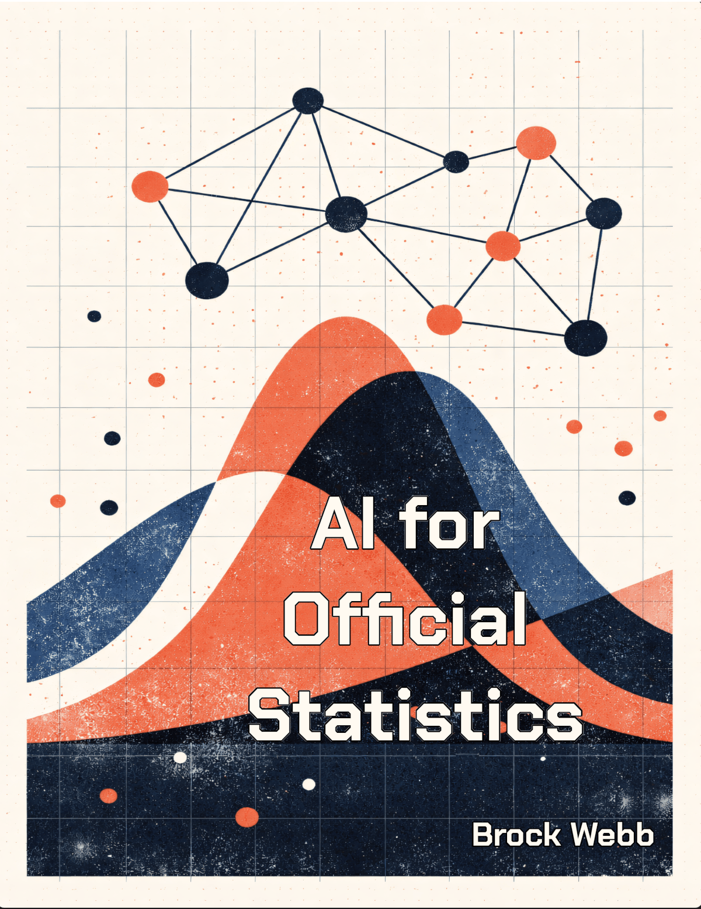

# AI for Official Statistics



A handbook for federal statisticians, survey methodologists, and data professionals in official statistics agencies. Fifteen chapters on machine learning, generative AI (including large language models), and agentic AI workflows — written for people who need to evaluate, govern, and reason about AI systems in federal statistical production.

**Read online:** [brockwebb.github.io/ai4stats](https://brockwebb.github.io/ai4stats/)

---

## Who Is This For?

- Federal employees in statistical agencies (Census, BLS, NCHS, etc.)
- Survey methodologists and statisticians with quantitative backgrounds
- Data scientists and ML practitioners working in or with government agencies
- Anyone who needs to evaluate AI methods, ask good questions of vendors and technical staff, or explain AI to leadership

**Not for:** People looking for a coding tutorial or model-building cookbook. This book teaches evaluation, governance, and critical judgment — not pip install.

---

## What This Covers

Fifteen chapters across five parts:

**Part I: ML Foundations for Evaluation (Chapters 1–4)**
Regression and classification, cross-validation and model selection, decision trees and random forests, neural network basics. The methods you need to understand before evaluating AI systems.

**Part II: Methods in Practice (Chapters 5–7)**
Graph thinking and record linkage, dimension reduction and geographic segmentation, imputation methods for survey data.

**Part III: Fairness, Privacy, and Synthetic Data (Chapters 8–10)**
Bias, fairness, and equity in federal AI; synthetic data generation; statistical disclosure limitation in the age of AI.

**Part IV: Language Models and Agentic AI (Chapters 11–13)**
Transformers, large language models, and agentic AI applied to survey operations.

**Part V: Governance and Capstone (Chapters 14–15)**
Evaluating AI systems for federal use. Capstone: reproducible AI-assisted research and State Fidelity Validity (SFV).

---

## Design Principles

**Judgment over tooling.** Every chapter explains what a method is, when it applies, when it does not, and how to explain it to leadership. The goal is informed evaluation, not engineering proficiency.

**No proprietary data.** All examples use public datasets: ACS PUMS, Census Bureau API, Bureau of Labor Statistics. No restricted access required.

**Prose-first.** Chapters read as prose. Runnable code is in the `examples/` directory, organized by chapter.

**Bounded agency.** AI assists, humans decide. This book is consistent with that principle throughout.

---

## Repository Structure

```
ai4stats/
├── book/                    # MyST Markdown source (15 chapters)
│   ├── myst.yml             # Build configuration and TOC
│   ├── chapter-01.md        # Regression and Classification
│   ├── ...
│   └── chapter-15.md        # Capstone / SFV
├── examples/                # Runnable code, organized by chapter
│   ├── chapter-01/
│   └── ...
├── archive/                 # Original chapters preserved for reference
│   └── original_chapters/
├── figures/                 # Cover art and diagrams
├── docs/                    # Design docs, SFV materials
└── ATTRIBUTION.md           # Licensing and inspiration
```

---

## State Fidelity Validity (SFV)

Chapter 15 introduces State Fidelity Validity, an original framework by Brock Webb for evaluating whether an AI-assisted research pipeline maintains the accuracy and integrity of its accumulated internal state across sequential operations. SFV extends classical validity theory (construct, internal, external, statistical conclusion) to account for the mutable instrumentation inherent in AI-assisted research. See `docs/sfv/` for background materials.

---

## License

CC BY 4.0. See LICENSE file.

---

## Author

Brock Webb. Views expressed are personal and do not represent any federal agency.
